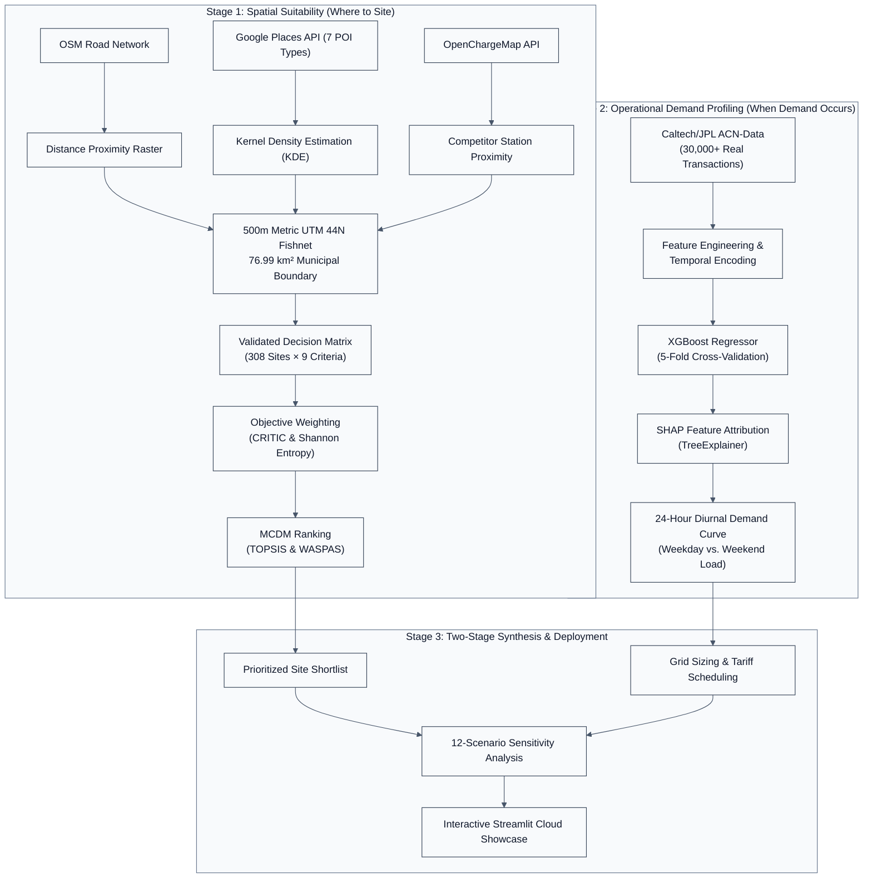

<div align="center">
  
  <h1>EV Siting Varanasi</h1>
  <p><b>Two-stage spatial GIS-MCDM and machine learning decision support framework for EV charging station siting.</b></p>

  [](https://github.com/Krishna200608/ev-siting-varanasi/actions/workflows/ci.yml)
  [](https://ev-siting-varanasi.streamlit.app)
  
  [](https://github.com/Krishna200608/ev-siting-varanasi/commits/main)
  [](LICENSE)
</div>

> [](https://ev-siting-varanasi.streamlit.app) **Live Interactive Web Application:** [https://ev-siting-varanasi.streamlit.app](https://ev-siting-varanasi.streamlit.app)  
> Explore interactive spatial candidate maps, live TOPSIS/WASPAS rankings, real-time What-If sensitivity weight explorers, 24-hour diurnal demand profiles, and automated data quality audits directly in your browser.

---

### Why This Project?

Tier-2 Indian cities face a critical infrastructure bottleneck: rapid electric two- and three-wheeler adoption outpaces public fast-charging deployment, creating substantial capital allocation risk for municipal planners and commercial charge-point operators (CPOs). Varanasi presents a distinct spatial challenge—an ancient, ultra-dense urban core bounded by the River Ganga, surrounded by rapidly expanding commercial corridors, with zero registered operational public fast-charging stations. This project develops and deploys an end-to-end, empirical decision-support framework that resolves this challenge through a rigorous two-stage architecture: spatial GIS-MCDM evaluates *where* physical infrastructure should be sited, while explainable machine learning models *when* diurnal charging demand occurs to de-risk station sizing, grid transformer capacity, and tariff scheduling.

---

## Table of Contents

- [Key Results & Empirical Highlights](#key-results--empirical-highlights)
- [Quick Start](#quick-start)
- [Pipeline Architecture](#pipeline-architecture)
- [Tech Stack & Dependencies](#tech-stack--dependencies)
- [Directory Structure & Synopsis Mapping](#directory-structure--synopsis-mapping)
- [Environment Setup & Installation](#environment-setup--installation)
- [Running the Pipelines](#running-the-pipelines)
- [Interactive Streamlit Showcase](#interactive-streamlit-showcase)
- [Testing & Continuous Integration](#testing--continuous-integration)
- [Key Architectural Decisions & Journey](#key-architectural-decisions--journey)
- [References & Academic Basis](#references--academic-basis)
- [Contributing](#contributing)
- [Author](#author)

---

## Key Results & Empirical Highlights

| Metric / Dimension | Value | Methodological Basis & Significance |
| :--- | :--- | :--- |
| **Candidate Alternatives** | **308 Sites** | Evaluated on a 500m metric fishnet grid projected into EPSG:32644 (UTM Zone 44N) and clipped to the verified **76.99 km²** Varanasi Nagar Nigam municipal polygon. |
| **Existing Fast Chargers** | **0 Stations** | Confirmed via OpenChargeMap API—identifying an unserved greenfield urban market where competitor cost criterion ($C_5$) evaluates uniformly. |
| **Top Optimal Siting Shortlist** | **`SITE_195`** (0.7459) | Godowlia / Girijaghar corridor ranks #1 across all 4 MCDM combinations (TOPSIS/WASPAS $\times$ CRITIC/Entropy), followed by `SITE_217`, `SITE_218`, `SITE_196`, and `SITE_194` (+0.14 lead over secondary nodes). |
| **Full-Feature ML Demand** | **$R^2 = 0.5058$** | XGBoost regressor trained on Caltech/JPL ACN-Data ($N=30,000+$ real charging sessions, $\text{RMSE} = 7.93\text{ kWh}$). SHAP attribution reveals dwell duration drives **76.2%** of predictive power. |
| **Transferable Siting Model** | **$R^2 = 0.0213$** | Strictly restricted to observable temporal dimensions to enforce zero-fabrication standards; projects a weekday midday peak (**17.77 kWh** at 12:00 PM) vs. weekend morning peak (**29.18 kWh** at 06:00 AM). |
| **Methodological Stability** | **$\rho \ge 0.88$** | Spearman rank correlation exceeds 0.88 across 11 of 12 perturbation scenarios; uncovered non-linear scale dependence in arterial road proximity ($S_{11}$: sample $\rho = 0.9613 \to$ citywide $\rho = 0.7763$). |

---

## Quick Start

Launch the complete interactive showcase dashboard locally in under **60 seconds**:

```bash
# 1. Clone the repository
git clone https://github.com/Krishna200608/ev-siting-varanasi.git
cd ev-siting-varanasi

# 2. Create and activate a virtual environment
python -m venv .venv
# On Windows (PowerShell): .\.venv\Scripts\Activate.ps1
# On Linux/macOS: source .venv/bin/activate

# 3. Install lightweight dashboard dependencies
pip install -r dashboard/requirements.txt

# 4. Launch the dashboard
streamlit run dashboard/app.py
```

*The dashboard will automatically launch in your default browser at `http://localhost:8501`.*

---

## Pipeline Architecture

The framework integrates two independent analytical pipelines that converge in a synthesis and decision-support stage:



---

## Tech Stack & Dependencies

The project maintains an intentional separation between heavy geospatial/ML pipeline dependencies and lightweight, cloud-optimized dashboard dependencies:

### Core & Data Processing


### Geospatial & Spatial GIS


### Machine Learning & Explainability


### Dashboard & Visualization


### Testing & CI/CD


---

## Directory Structure & Synopsis Mapping

```
ev-siting-varanasi/
├── .github/workflows/ci.yml       # Dual-job automated CI pipeline (full test suite + smoke tests)
├── assets/Logos/                  # Official high-resolution project logo variations
├── config/criteria.yaml           # MCDM criteria definitions, orientation types, and spatial extents
├── dashboard/                     # Lightweight Streamlit showcase web application
│   ├── app.py                     # Entry point: Executive overview & headline metrics
│   ├── pages/                     # 7 multi-page analytical modules
│   ├── utils/                     # Fast cached loaders & live NumPy TOPSIS vector engine
│   └── requirements.txt           # Isolated, lightweight dependencies for cloud deployment
├── data/
│   ├── raw/                       # Cached OSM Overpass, Google Places, & ACN telemetry
│   └── processed/gis/             # Decision matrices (v1 baseline and v2 equal-scrutiny)
├── docs/
│   ├── ROADMAP.md                 # Complete milestone progression record (Milestones 1–8b)
│   └── PENDING_DECISIONS.md       # Chronological architectural decisions (AD-1 through AD-11)
├── outputs/
│   ├── figures/                   # Sensitivity plots, SHAP summary plots, diurnal demand curves
│   ├── models/                    # Serialized XGBoost models (full-feature & transferable)
│   ├── reports/                   # Academic evaluation reports & data quality audits
│   └── tables/                    # MCDM ranking CSVs, sensitivity tables, and feature rankings
├── src/
│   ├── gis/                       # Grid generation, KDE/proximity rasterization, quality gatekeepers
│   ├── mcdm/                      # Pure vector CRITIC, Shannon Entropy, TOPSIS, and WASPAS algorithms
│   ├── ml/                        # ACN-Data ingest, XGBoost training, cross-validation, and SHAP
│   └── integration/               # 12-scenario sensitivity analysis and diurnal demand synthesis
├── tests/                         # Complete 42-test automated suite (GIS, MCDM, ML, Data Quality, Smoke)
├── requirements.txt               # Full repository dependencies (Heavy GIS & ML stack)
└── AGENTS.md                      # Engineering standards, typing rules, and zero-fabrication policies
```

---

## Environment Setup & Installation

### Option A: Full Research Pipeline Stack (GIS + ML + Testing)
For executing the data acquisition, rasterization, and machine learning pipelines:

```bash
# 1. Clone repository
git clone https://github.com/Krishna200608/ev-siting-varanasi.git
cd ev-siting-varanasi

# 2. Virtual environment setup
python -m venv .venv
source .venv/bin/activate  # On Windows: .\.venv\Scripts\Activate.ps1

# 3. Install complete dependencies
pip install --upgrade pip
pip install -r requirements.txt
```

### Option B: API Configuration (Optional for Live Ingest)
Copy `.env.example` to `.env` if re-fetching spatial POIs:
```bash
cp .env.example .env
```
- `GOOGLE_PLACES_API_KEY`: Required for querying the Google Places API (New).
- `OPENCHARGEMAP_API_KEY`: Required for querying OpenChargeMap.

*(Note: Pre-computed and quality-audited datasets are already included in `data/processed/gis/` and `outputs/tables/`, allowing all analyses and dashboards to run immediately without active API keys).*

---

## Running the Pipelines

### Stage 1: Spatial GIS Decision Matrix Builder
Constructs the metric 500m fishnet over Varanasi Nagar Nigam (76.99 km²) and calculates Kernel Density Estimation surfaces:
```bash
python src/gis/build_decision_matrix.py
```
*Output: `data/processed/gis/decision_matrix_full_v2.csv` (308 sites $\times$ 9 spatial criteria).*

### Stage 2: MCDM Weighting & Siting Optimization
Computes objective CRITIC and Shannon Entropy weights and ranks all 308 alternatives via TOPSIS and WASPAS:
```bash
python -c "from src.mcdm.pipeline import run_mcdm_pipeline; run_mcdm_pipeline(decision_matrix_path='data/processed/gis/decision_matrix_full_v2.csv', output_table_path='outputs/tables/mcdm_rankings_full_v2.csv')"
```
*Output: `outputs/tables/mcdm_rankings_full_v2.csv`.*

### Stage 3: Machine Learning Demand Forecasting & SHAP
Trains the XGBoost regressors on real session telemetry and generates SHAP explainability plots:
```bash
# 1. Full-Feature Descriptive Model
python -c "from src.ml.train_demand_model import train_and_save_pipeline; from src.ml.explain import generate_shap_artifacts; model, X, metrics = train_and_save_pipeline(); generate_shap_artifacts(model, X)"

# 2. Ex-Ante Transferable Siting Model
python -c "from src.ml.train_demand_model import train_and_save_transferable_pipeline; from src.ml.explain import generate_shap_artifacts; model, X, metrics = train_and_save_transferable_pipeline(); generate_shap_artifacts(model, X, 'outputs/figures/shap_summary_transferable.png', 'outputs/tables/shap_feature_importance_transferable.csv')"
```

### Stage 4: Multi-Scenario Sensitivity & Diurnal Profiling
Runs the 12-scenario weight perturbation analysis and builds the 24-hour diurnal demand profile:
```bash
python src/integration/pipeline.py
```

<details>
<summary><b>Click to view Milestone 6 & 7 Extended Execution Commands</b></summary>

```bash
# Milestone 6: Full Citywide Run (v1 Baseline)
python -c "from src.gis.build_decision_matrix import build_decision_matrix; build_decision_matrix(mode='full')"
python -c "from src.mcdm.pipeline import run_mcdm_pipeline; run_mcdm_pipeline(decision_matrix_path='data/processed/gis/decision_matrix_full.csv', output_table_path='outputs/tables/mcdm_rankings_full.csv')"

# Milestone 7: Equal-Scrutiny Multi-Zone Run (v2 Mesh across Sigra, Lanka, Cantt, Godowlia)
python -c "from src.gis.build_decision_matrix import build_decision_matrix; build_decision_matrix(mode='full_v2')"
python -c "from src.mcdm.pipeline import run_mcdm_pipeline; run_mcdm_pipeline(decision_matrix_path='data/processed/gis/decision_matrix_full_v2.csv', output_table_path='outputs/tables/mcdm_rankings_full_v2.csv')"
```
</details>

---

## Interactive Streamlit Showcase

The web showcase dashboard ([https://ev-siting-varanasi.streamlit.app](https://ev-siting-varanasi.streamlit.app)) provides a comprehensive presentation interface organized into 7 analytical pages:

| Page | Module Name | Interactive Capabilities & Content |
| :--- | :--- | :--- |
| **Home** | `app.py` | Executive summary, 2-stage methodology architecture, and headline urban indicators. |
| **Page 1** | `1_Site_Map.py` | Full-screen interactive Folium map displaying all 308 candidate alternatives colored by TOPSIS suitability with Top-5 gold-bordered markers, click popups, and a v1 vs. v2 spatial scrutiny comparison toggle. |
| **Page 2** | `2_MCDM_Rankings.py` | Searchable, sortable consolidated rankings table across all 4 MCDM combinations with urban zone filters (Godowlia, Sigra, Lanka, Cantt, Peri-Urban), Spearman rank concordance matrices, and CSV export. |
| **Page 3** | `3_Whatif_Weight_Explorer.py` | Real-time interactive sensitivity tool with 9 criteria sliders and quick presets (CRITIC default, Equal weights, Road arterial focus, Mall focus, Hospital focus) computing live TOPSIS re-rankings and rank-shift scatter plots. |
| **Page 4** | `4_Demand_and_SHAP.py` | 24-hour diurnal energy load curves (weekday midday peak vs. weekend morning charge), SHAP feature importance plots, and methodological synthesis on operational timing (RQ3). |
| **Page 5** | `5_Sensitivity_Analysis.py` | 12-scenario criteria weight perturbation analysis, radar/bar plots, and scale-dependent road proximity dynamics ($S_{11}$: $\rho = 0.9613 \to 0.7763$). |
| **Page 6** | `6_Data_Quality_Audit.py` | Systematic 9-criteria $\times$ 2-version audit table, automated degeneracy safeguards, and root-cause diagnostics on $C_5$ (Competitor EVCS) and $C_6$ (Hospitals). |
| **Page 7** | `7_Project_Journey.py` | Grounded chronological record of architectural decisions (AD-1 through AD-11) documenting problems encountered, empirical findings, and verified solutions. |

---

## Testing & Continuous Integration

The repository includes a comprehensive 42-test automated suite executed via `pytest`. All tests execute locally with zero live network calls:

```bash
# Run the complete test suite (GIS, MCDM, ML, Integration, Quality, Smoke)
pytest tests/ -v

# Run the isolated lightweight dashboard smoke suite
pytest tests/test_dashboard.py tests/test_dashboard_smoke.py -v
```

### GitHub Actions CI Workflow
Automated testing is configured in [`.github/workflows/ci.yml`](.github/workflows/ci.yml) with two parallel jobs:
1. **`full-pipeline-tests`:** Runs all 42 tests against the complete scientific and ML dependency stack under Python 3.13.
2. **`dashboard-only-smoke`:** Installs strictly `dashboard/requirements.txt` to dynamically prove that the dashboard executes in lightweight cloud environments without heavy GIS C-extensions.

---

## Key Architectural Decisions & Journey

The project adheres to strict empirical and architectural standards documented in [`docs/PENDING_DECISIONS.md`](docs/PENDING_DECISIONS.md):

* **AD-1 (Spatial Sampling):** Adopted a regular metric 500m fishnet grid projected into EPSG:32644 (UTM Zone 44N) over Voronoi tessellation to eliminate sampling bias.
* **AD-4 (Zero-Fabrication Policy):** Rejected synthetic Kaggle EV datasets in favor of real, verified charging session telemetry from Caltech/JPL ACN-Data ($N=30,000+$).
* **AD-6 (No Dwell-Time Proxies):** Rejected fabricated dwell-time assumptions for Varanasi; formulated an honest, observable Transferable Temporal Model ($R^2 \approx 0.02$).
* **AD-8 (Resolution of RQ3):** Proved that multiplying spatial footfall by temporal ML scalars is mathematically inert upon normalization; established the Two-Stage framework separating *Where* (GIS-MCDM) from *When* (ML Demand).
* **AD-9 (Administrative Boundary):** Sourced a verified 76.99 km² Varanasi Nagar Nigam municipal polygon to evaluate true urban territory (308 sites) rather than coarse 1,500 km² rural district boxes.
* **AD-10 (Equal-Scrutiny Validation):** Tested 5-tile nested meshes ($r=800\text{m}$) across Sigra, Lanka, and Cantt to prove Godowlia's #1 ranking is a genuine urban concentration (+0.14 lead) rather than a spatial measurement artifact.
* **AD-11 (Dependency-Light Dashboard):** Architected the showcase dashboard to read pre-computed static artifacts and use pure NumPy vector math for live What-If calculations, ensuring instant cloud boot times.

---

## References & Academic Basis

1. **Rashmitha, S., et al. (2024).** *GIS-based MCDM framework for optimal siting of EV charging infrastructure using CRITIC-TOPSIS.* Energy Strategy Reviews.
2. **Guo, S., & Zhao, H. (2015).** *Optimal site selection of electric vehicle charging stations by using fuzzy TOPSIS and WASPAS based on Shannon entropy.* Journal of Cleaner Production.
3. **Zhang, Y., et al. (2025).** *Spatial-temporal EV charging demand forecasting using explainable gradient boosted decision trees and SHAP.* Applied Energy.
4. **Lee, Z. J., et al. (2019).** *ACN-Data: Analysis and Applications of an Open EV Charging Dataset.* e-Energy '19: Proceedings of the Tenth ACM International Conference on Future Energy Systems.

---

## Contributing

Contributions, issues, and feature suggestions are welcome:
1. Fork the repository.
2. Create a dedicated feature branch (`git checkout -b feature/new-analysis`).
3. Ensure all tests pass (`pytest tests/ -v`).
4. Submit a detailed Pull Request.

---

## Author

**Krishna Sikheriya**  
*B.Tech Student at IIIT Allahabad*  
[](https://github.com/Krishna200608)
[](https://github.com/Krishna200608/ev-siting-varanasi)
